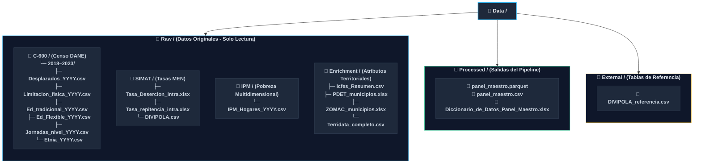

# Project Structure — Early School Dropout in Colombia

> **Master’s in Business Analytics** · Universidad del Rosario  
> Author: Juan Felipe Malaver  
> Methodology: CRISP-DM · Period: 2018–2023

---

## 1. Problem Statement & Motivation

In Colombia, the intra-annual school dropo# Project Structure — Early School Dropout in Colombia

> **Master's in Business Analytics** · Universidad del Rosario
> Author: Juan Felipe Malaver
> Methodology: CRISP-DM · Period: 2018–2023

---

## 1. Problem Statement & Motivation

In Colombia, the intra-annual school dropout rate in the public sector averages between 3% and 5% nationally. However, regional disparities are extreme: rural municipalities, conflict zones, or areas with high geographical dispersion can experience dropout rates exceeding 20%. When students leave the school system mid-year, Secretariats of Education usually find out too late to intervene. This results in lost public funds due to misallocated resources and leaves thousands of young people trapped in poverty, unable to reach their full potential or contribute to society.

The issue is not a lack of data. The Colombian government has systematically recorded campus-level enrollment, schedules, educational levels, and special populations for years through the C-600 census and the SIMAT system. The real problem is that this information has never been integrated into a system capable of **anticipating** dropout risk before abandonment occurs.

This project builds that predictive system. The final product is an **early warning model** that predicts which educational sites are at high risk of elevated dropout rates in the following year and identifies the underlying causes. This tool enables Colombia's 97 Certified Secretariats of Education to target proactive interventions efficiently, combining predictive risk scoring with actionable, data-driven recommendations for site-level intervention.

The three core research questions guiding this project are:

1. Which educational sites face the highest risk of student dropout next year?
2. Which factors explain this risk, and to what extent?
3. Is the consolidated model equally accurate for school sites serving vulnerable populations (victims of armed conflict, ethnic minorities, students with disabilities)?

---

## 2. Target Variable & Project Scope

| Dimension | Decision |
|---|---|
| **Unit of Analysis** | Educational site × year (`SEDE_CODIGO` × `PERIODO_ANIO`) |
| **Target Variable** | Municipal intra-annual dropout rate imputed to each school site (`TASA_DESERCION_MPIO`) |
| **Problem Type** | Binary classification (High / Low Risk) — threshold defined with advisor |
| **Training Window** | 2018–2022 (`SAMPLE = TRAIN`) |
| **Test Window** | 2023 (`SAMPLE = TEST`) |
| **Out-of-Time Validation** | 2024 (holdout — pending SINEB/ICFES publication as of Sept 2026) |
| **Candidate Algorithms** | Logistic Regression (baseline) · Random Forest · XGBoost / LightGBM |
| **Feature Space** | 61 variables across 8 thematic domains |

The target variable is not directly available at the site level: SIMAT only publishes dropout rates aggregated at the municipal level. To address this, the project applies **homoscedastic imputation** — assigning the municipal rate to all educational sites within the same municipality and year. For municipalities without a municipal-level rate (primarily Amazonia and Orinoquía departments), a departmental average fallback is applied. Both assumptions are documented as project limitations.

For Bogotá, the C-600 assigns locality-level codes (`11xxx`) to sites, but SIMAT reports one unified rate under code `11001`. All Bogotá locality codes are remapped to `11001` prior to the SIMAT join. The legacy Putumayo code `83` present in some C-600 records is remapped to the official DANE code `86` before any join.

The ultimate goal goes beyond optimizing AUC: it aims to generate an **actionable site risk ranking** that education officials can interpret and act on, supported by natural language explanations of why a specific site is flagged as high risk.

---

## 3. Data Architecture

```
Data/
├── Raw/                                    # Original raw data — never edit directly
│   ├── C-600/                              # Formal Education Census (DANE) — site level
│   │   ├── 2018/ … 2023/                   # One subfolder per year
│   │   │   ├── Desplazados_YYYY.csv
│   │   │   ├── Limitacion_fisica_YYYY.csv
│   │   │   ├── Ed_tradicional_YYYY.csv
│   │   │   ├── Ed_Flexible_YYYY.csv
│   │   │   ├── Jornadas_nivel_YYYY.csv     ← skeleton of the panel
│   │   │   └── Etnia_YYYY.csv
│   ├── SIMAT/                              # Municipal rates (MEN)
│   │   ├── Tasa_Desercion_intra_Departamentos.xlsx
│   │   ├── Tasa_repitencia_intra_Departamentos.xlsx
│   │   └── DIVIPOLA.csv                   # Municipality name → DANE code lookup
│   ├── IPM/                               # Multidimensional Poverty Index (DANE-ECV)
│   │   └── IPM_Hogares_YYYY.csv           # 2018–2023
│   │                                      # sep=";" for 2018–2020 | sep="," for 2021–2023
│   └── Enrichment/
│       ├── Icfes_Resumen.csv              # Aggregated from student-level DataIcfes files
│       ├── PDET_municipios.xlsx           # 170 PDET municipalities with DANE code
│       └── ZOMAC_municipios.xlsx          # 344 ZOMAC municipalities with DANE code
├── Processed/
│   ├── panel_maestro.parquet              # Primary panel — 319,609 rows × 61 cols
│   ├── panel_maestro.csv
│   └── diagnostico_panel.xlsx
└── External/
    └── DIVIPOLA_referencia.csv
```

---

## 4. Feature Domains (61 Variables)

| # | Domain | Variables | Level | Source |
|---|---|---|---|---|
| 1 | Identification & Geography | 6 | Site / Municipal / Dept | DANE DIVIPOLA |
| 2 | Municipal Rates & Temporal Features | 5 | Municipality | MEN SINEB |
| 3 | Enrollment Dynamics | 5 | Site | DANE C-600 |
| 4 | Population Characterization | 15 | Site | DANE C-600 |
| 5 | Proportions & Synthetic Indices | 7 | Site | Calculated (C-600) |
| 6 | ICFES Saber 11° Performance | 13 + 1 flag | Site | DataIcfes |
| 7 | Multidimensional Poverty (IPM) | 16 | Region (9 DANE macro-regions) | DANE ECV |
| 8 | Territorial & Conflict Flags | 2 | Municipality | FINAGRO / ART / DIAN |

**Domain 1 — Identification & Geography**
`SEDE_CODIGO`, `PERIODO_ANIO`, `SAMPLE`, `COD_MPIO_DANE`, `COD_DPTO_DANE`, `REGION_DANE`

**Domain 2 — Municipal Rates & Temporal Features**
`TASA_DESERCION_MPIO`, `TASA_REPITENCIA_MPIO`, `DESERCION_LAG1`, `REPITENCIA_LAG1`, `DESERCION_MA2_LAG`
Coverage: 95.6% municipal match. Remaining 4.4% filled with departmental average fallback.

**Domain 3 — Enrollment Dynamics**
`MATRICULA_TOTAL`, `FLAG_PANDEMIA`, `MATRICULA_DELTA`, `MATRICULA_PCT_CAMBIO`, `FLAG_DECLIVE_MATRICULA`
`FLAG_PANDEMIA = 1` for 2020. Decision to include/exclude from training pending advisor.

**Domain 4 — Population Characterization (15 variables)**
Counts by sex and total for displaced students (`DESPLAZADOS_*`), students with disabilities (`LIMITACION_*`), traditional model (`TRADICIONAL_*`), flexible model (`FLEXIBLE_*`), ethnic groups (`ETNIA_*`).
All count columns filled with 0 where no record exists for that site-year.

**Domain 5 — Proportions & Synthetic Indices (7 variables)**
`PROP_DESPLAZADOS`, `PROP_LIMITACION`, `PROP_TRADICIONAL`, `PROP_FLEXIBLE`, `PROP_ETNIA`, `IDX_FEMINIDAD`, `INDICE_VULNERABILIDAD`
`INDICE_VULNERABILIDAD` = Desplazados×2 + Limitación×1.5 + Etnia×1 + Flexible×0.5.

**Domain 6 — ICFES Saber 11° (13 variables + 1 flag)**
`ICFES_CANT_ESTUDIANTES`, `ICFES_PROM_PUNT_GLOBAL`, `ICFES_PROM_LECTURA`, `ICFES_PROM_MATEMATICAS`, `ICFES_PROM_CIENCIAS`, `ICFES_PROM_SOCIALES`, `ICFES_PROM_INGLES`, `ICFES_PROM_INSE`, `ICFES_PCT_ESTRATO_1_2`, `ICFES_PCT_INTERNET`, `ICFES_PCT_COMPUTADOR`, `ICFES_PCT_DESPLAZACOLEGIO`, `ICFES_PCT_HORASTRABNOREMU`
`TIENE_GRADO_11`: 1 if site has ICFES records for that year, 0 otherwise.
Coverage is partial by design — only sites with Grade 11 appear in Saber 11° data.

**Domain 7 — Multidimensional Poverty IPM (16 variables)**
`IPM_INASISTENCIA_ESCOLAR`, `IPM_REZAGO_ESCOLAR`, `IPM_TRABAJO_INFANTIL`, `IPM_HACINAMIENTO`, `IPM_EMPLEO_FORMAL`, `IPM_ALFABETISMO`, `IPM_LOGRO_EDUCATIVO`, `IPM_ASEGURAMIENTO_SALUD`, `IPM_BARRERAS_ACCESO_SALUD`, `IPM_PAREDES`, `IPM_PISOS`, `IPM_ALCANTARILLADO`, `IPM_ACUEDUCTO`, `IPM_DESEMPLEO_LARGA_DURACION`, `IPM_ATENCION_INTEGRAL`, `IPM_IPM`
Joined via `COD_DPTO_DANE → REGION_DANE`. All 33 departments mapped. Coverage: 96.7% all years.

**Domain 8 — Territorial & Conflict Flags (2 variables)**
`FLAG_PDET`: 72,484 sede-years in 170 post-peace-agreement priority municipalities.
`FLAG_ZOMAC`: 110,734 sede-years in 344 conflict-affected municipalities.

---

## 5. Key Technical Notes

### SEDE_CODIGO Format
The C-600 assigns a 13-digit code with a leading `1` prefix not present in the standard DANE code.
- `COD_MPIO_DANE` = `SEDE_CODIGO[1:6]` (5-digit municipal DANE code)
- `COD_DPTO_DANE` = `SEDE_CODIGO[1:3]` (2-digit department code)

### Join Edge Cases & Resolutions

| Case | Cause | Resolution |
|---|---|---|
| Bogotá localities `11102`–`11850` | C-600 uses locality codes; SIMAT only reports `11001` | Remapped to `11001` before SIMAT join |
| Putumayo `83xxx` codes | Legacy internal C-600 code; official DANE code is `86` | Remapped `83→86` in pipeline |
| Amazonia / Orinoquía municipalities | SIMAT does not publish municipal rates for very small municipalities | Departmental average applied as fallback |
| San Andrés / Providencia | `SAN ANDRES` appears in 3 departments | Disambiguated by `DEPARTAMENTO_STD` containing `ARCHIPIELAGO` |
| Cali | SIMAT uses `"SANTIAGO DE CALI"`, DIVIPOLA uses `"CALI"` | Manual name correction applied before join |

### IPM File Separator
IPM files 2018–2020 use `sep=";"`. Files 2021–2023 use `sep=","`. The pipeline auto-detects the separator.

---

## 6. Data Sources

| Source | File | URL |
|---|---|---|
| DANE C-600 | `C-600/YYYY/*.csv` | https://microdatos.dane.gov.co/index.php/catalog/834/get-microdata |
| MEN SINEB | `SIMAT/*.xlsx` | http://bi.mineducacion.gov.co:8380/eportal/web/sineb/22.-tasa-de-desercion-intra-anual |
| DANE IPM (ECV) | `IPM/IPM_Hogares_YYYY.csv` | https://www.datos.gov.co/dataset/Indice-de-Pobreza-Multidimensional-IPM-2024/ntk3-fdqa/about_data |
| DataIcfes Saber 11° | `Enrichment/Icfes_Resumen.csv` | https://bitly.ws/3f3YC |
| PDET | `Enrichment/PDET_municipios.xlsx` | https://www.finagro.com.co/sites/default/files/documents/2022-02/ANEXO%20MUNICIPIOS%20PDET.xlsx |
| ZOMAC | `Enrichment/ZOMAC_municipios.xlsx` | https://www.finagro.com.co/sites/default/files/documents/2022-02/ANEXO%20MUNICIPIOS%20ZOMAC.xlsx |
| DIVIPOLA | `SIMAT/DIVIPOLA.csv` | https://www.datos.gov.co/api/views/gdxc-w37w/rows.csv?accessType=DOWNLOAD |

> No 2024 data available for C-600 or IPM as of September 2026.

---

## 7. Repository Scripts

| File | Language | Purpose |
|---|---|---|
| `0_COD_Procesamiento_A_Exploratorio.R` | R | Full EDA — distributions, quality audit, APA figures |
| `1_COD_Graficas_diagnostico.R` | R | Diagnostic figures for thesis document |
| `2_COD_Agrupacion_ICFES.R` | R | Aggregates student-level ICFES raw files to site × year |
| `3_COD_Panel_creation.ipynb` | Python | Master panel pipeline — all joins, feature engineering, export |
| `4_COD_Diagnostico_Panel.py` | Python | Post-pipeline quality checker — coverage, joins, correlations |

---

*v1.3 — Updated Sept 2026 · Next update: modeling phase (E7, Nov 2026)*ut rate in the public sector averages between 3% and 5% nationally. However, regional disparities are extreme: rural municipalities, conflict zones, or areas with high geographical dispersion can experience dropout rates exceeding 20%. When students leave the school system mid-year, Secretariats of Education usually find out too late to intervene. This results in lost public funds due to misallocated resources and leaves thousands of young people trapped in poverty, unable to reach their full potential or contribute to society.

The issue is not a lack of data. The Colombian government has systematically recorded campus-level enrollment, schedules, educational levels, and special populations for years through the C-600 census and the SIMAT system. The real problem is that this information has never been integrated into a system capable of **anticipating** dropout risk before abandonment occurs.

This project builds that predictive system. The final product is an **early warning model** that predicts which educational sites are at high risk of elevated dropout rates in the following year and identifies the underlying causes. This tool enables Colombia’s 97 Certified Secretariats of Education to target proactive interventions efficiently, combining predictive risk scoring with actionable, data-driven recommendations for site-level intervention.

The three core research questions guiding this project are:

1. Which educational sites face the highest risk of student dropout next year?
2. Which factors explain this risk, and to what extent?
3. Is the consolidated model equally accurate for school sites serving vulnerable populations (victims of armed conflict, ethnic minorities, students with disabilities)?

---

## 2. Target Variable & Project Scope

| Dimension | Decision |
|---|---|
| **Unit of Analysis** | Educational site × year (`SEDE_CODIGO` × `PERIODO_ANIO`) |
| **Target Variable** | Municipal intra-annual dropout rate imputed to each school site (`TASA_DESERCION_MPIO`) |
| **Problem Type** | Binary classification (High / Low Risk) — threshold defined with advisor |
| **Training Window** | 2018–2023 |
| **Out-of-Time Validation** | 2024 (holdout dataset, pending publication by SINEB/ICFES) |
| **Candidate Algorithms** | Logistic Regression (baseline) · Random Forest · XGBoost / LightGBM |
| **Feature Space** | 70 variables structured across 8 thematic domains |

The target variable is not directly available at the site level, as SIMAT only publishes dropout rates aggregated at the municipal level. To address this, the project applies **homoscedastic imputation**: assigning the municipal rate to all educational sites within the same municipality and year, assuming municipal-level conditions impact all local sites uniformly. This assumption is documented as a project limitation[cite: 1].

The ultimate goal goes beyond optimizing predictive metrics like AUC; it aims to generate an **actionable site risk ranking**[cite: 1]. Education officials can easily interpret this ranking to prioritize interventions, supported by natural language explanations detailing why a specific site is at risk[cite: 1].

---

```mermaid
graph TD
    DATA["📁 Data /"]

    subgraph RAW ["📁 Raw / (Datos Originales - Solo Lectura)"]
        direction TB
        C600["📂 C-600 / (Censo DANE)<br/>└─ 2018–2023/<br/>   ├─ Desplazados_YYYY.csv<br/>   ├─ Limitacion_fisica_YYYY.csv<br/>   ├─ Ed_tradicional_YYYY.csv<br/>   ├─ Ed_Flexible_YYYY.csv<br/>   ├─ Jornadas_nivel_YYYY.csv<br/>   └─ Etnia_YYYY.csv"]
        
        SIMAT["📂 SIMAT / (Tasas MEN)<br/>├─ Tasa_Desercion_intra.xlsx<br/>├─ Tasa_repitencia_intra.xlsx<br/>└─ DIVIPOLA.csv"]
        
        IPM["📂 IPM / (Pobreza Multidimensional)<br/>└─ IPM_Hogares_YYYY.csv"]
        
        ENRICH["📂 Enrichment / (Atributos Territoriales)<br/>├─ Icfes_Resumen.csv<br/>├─ PDET_municipios.xlsx<br/>├─ ZOMAC_municipios.xlsx<br/>└─ Terridata_completo.csv"]
    end

    subgraph PROC ["📁 Processed / (Salidas del Pipeline)"]
        direction TB
        PROCDETAIL["📄 panel_maestro.parquet<br/>📄 panel_maestro.csv<br/>📄 Diccionario_de_Datos_Panel_Maestro.xlsx"]
    end

    subgraph EXT ["📁 External / (Tablas de Referencia)"]
        direction TB
        EXTDETAIL["📄 DIVIPOLA_referencia.csv"]
    end

    DATA --> RAW
    DATA --> PROC
    DATA --> EXT

    %% Clases de Estilo
    classDef root fill:#1e293b,stroke:#38bdf8,stroke-width:2px,color:#f8fafc,font-weight:bold;
    classDef rawGroup fill:#0f172a,stroke:#38bdf8,stroke-width:1px,color:#e2e8f0;
    classDef procGroup fill:#0f172a,stroke:#34d399,stroke-width:1px,color:#e2e8f0;
    classDef extGroup fill:#0f172a,stroke:#fbbf24,stroke-width:1px,color:#e2e8f0;
    classDef nodeBox fill:#1e293b,stroke:#334155,color:#cbd5e1;

    %% Aplicación de estilos
    class DATA root;
    class RAW rawGroup;
    class PROC procGroup;
    class EXT extGroup;
    class C600,SIMAT,IPM,ENRICH,PROCDETAIL,EXTDETAIL nodeBox;
```

---

## 4. Summary of Master Panel Feature Domains (70 Variables)

The consolidated dataset (`panel_maestro.parquet`) integrates **70 variables** across **8 thematic domains**:

| Domain # | Domain Name | Count | Aggregation Level | Primary Data Source | Key Features Included |
|---|---|---|---|---|---|
| **1** | **Identification & Geography** | 6 | Site / Municipal / Dept | DANE DIVIPOLA | `SEDE_CODIGO`, `PERIODO_ANIO`, `SAMPLE`, `COD_MPIO_DANE`, `COD_DPTO_DANE`, `REGION_DANE` |
| **2** | **Municipal Rates & Indicators** | 5 | Municipality | Mineducación (SINEB) | `TASA_DESERCION_MPIO`, `TASA_REPITENCIA_MPIO`, `DESERCION_LAG1`, `REPITENCIA_LAG1`, `DESERCION_MA2_LAG` |
| **3** | **Enrollment Dynamics** | 5 | Educational Site | DANE (C-600) | `MATRICULA_TOTAL`, `FLAG_PANDEMIA`, `MATRICULA_DELTA`, `MATRICULA_PCT_CAMBIO`, `FLAG_DECLIVE_MATRICULA` |
| **4** | **Population Characterization** | 15 | Educational Site | DANE C-600 Microdata | Displaced students (`DESPLAZADOS_*`), Disabilities (`LIMITACION_*`), Traditional models (`TRADICIONAL_*`), Flexible models (`FLEXIBLE_*`), Ethnic groups (`ETNIA_*`) |
| **5** | **Proportions & Synthetic Indices** | 7 | Educational Site | Calculated (C-600) | `PROP_DESPLAZADOS`, `PROP_LIMITACION`, `PROP_TRADICIONAL`, `PROP_FLEXIBLE`, `PROP_ETNIA`, `IDX_FEMINIDAD`, `INDICE_VULNERABILIDAD` |
| **6** | **ICFES Saber 11° Performance** | 14 | Educational Site | DataIcfes (Saber 11) | `ICFES_PROM_PUNT_GLOBAL`, Subtest scores (Math, Reading, Sciences, Socials, English), `ICFES_PROM_INSE`, `% Estrato 1-2`, `% Internet`, `% Computer`, `% Unpaid Labor`, `% Campesina` |
| **7** | **Multidimensional Poverty (IPM)** | 16 | Municipality | DANE / DNP Terridata | Deprivation rates in school attendance, school lag, child labor, overcrowding, informal employment, literacy, health, water/sewage, and overall `IPM_IPM` |
| **8** | **Territorial & Conflict Flags** | 2 | Municipality | FINAGRO / ART / MinHacienda | `FLAG_PDET` (170 municipalities), `FLAG_ZOMAC` (344 municipalities) |

---

### Detailed Source Descriptions

#### Source 1 — DANE C-600 Census (Site Level)
* **Description:** DANE's annual enrollment census covering every educational site in Colombia. It serves as the primary predictor source and highest-granularity dataset.
* **Extraction Method:** Downloaded from DANE's microdata catalog (`latin1` encoding).
* **Critical Technical Note:** `SEDE_CODIGO` must be imported as a string and zero-padded to 12 digits using `zfill(12)` to prevent scientific notation truncation.
* **Direct Link:** https://microdatos.dane.gov.co/index.php/catalog/834/get-microdata

#### Source 2 — MEN SINEB System (Municipal Level)
* **Description:** Contains intra-annual dropout and grade repetition rates from the Ministry of National Education (MEN). Filters exclusively for `TERRITORIO = MUNICIPIO` and `SECTOR = Oficial`.
* **Key Columns:** `TASA_DESERCION_MPIO`, `TASA_REPITENCIA_MPIO`, `DESERCION_LAG1`, `REPITENCIA_LAG1`, `DESERCION_MA2_LAG`.
* **Direct Link:** http://bi.mineducacion.gov.co:8380/eportal/web/sineb/22.-tasa-de-desercion-intra-anual

#### Source 3 — ICFES Saber 11° Results (Site Level)
* **Description:** School performance metrics and student socio-economic indicators.
* **Key Features:** Average global score (`ICFES_PROM_PUNT_GLOBAL`), subject scores, average socio-economic index (`ICFES_PROM_INSE`), percent with internet access, percent with computer, percent working unpaid hours, and percent rural/campesina population.
* **Direct Link:** https://bitly.ws/3f3YC

#### Source 4 — DNP Terridata & DANE IPM 2024 (Municipal Level)
* **Description:** 16 indicators measuring specific dimensions of household multidimensional poverty.
* **Key Features:** School non-attendance rate (`IPM_INASISTENCIA_ESCOLAR`), educational lag (`IPM_REZAGO_ESCOLAR`), child labor (`IPM_TRABAJO_INFANTIL`), overcrowding, housing quality, health coverage, and composite `IPM_IPM`.
* **Direct Link:** https://www.datos.gov.co/dataset/Indice-de-Pobreza-Multidimensional-IPM-2024/ntk3-fdqa/about_data

#### Source 5 — Territorial & Conflict Classifications (PDET & ZOMAC)
* **Description:** Special territorial designations indicating conflict impact and priority government focus.
* **Key Features:** `FLAG_PDET` (170 priority municipalities) and `FLAG_ZOMAC` (344 conflict-affected municipalities).
* **Direct Links:**
  - PDET: https://www.finagro.com.co/sites/default/files/documents/2022-02/ANEXO%20MUNICIPIOS%20PDET.xlsx
  - ZOMAC: https://www.finagro.com.co/sites/default/files/documents/2022-02/ANEXO%20MUNICIPIOS%20ZOMAC.xlsx
  - DIVIPOLA: https://www.datos.gov.co/api/views/gdxc-w37w/rows.csv?accessType=DOWNLOAD
"""
